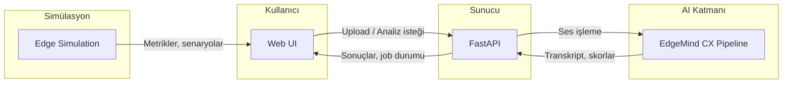
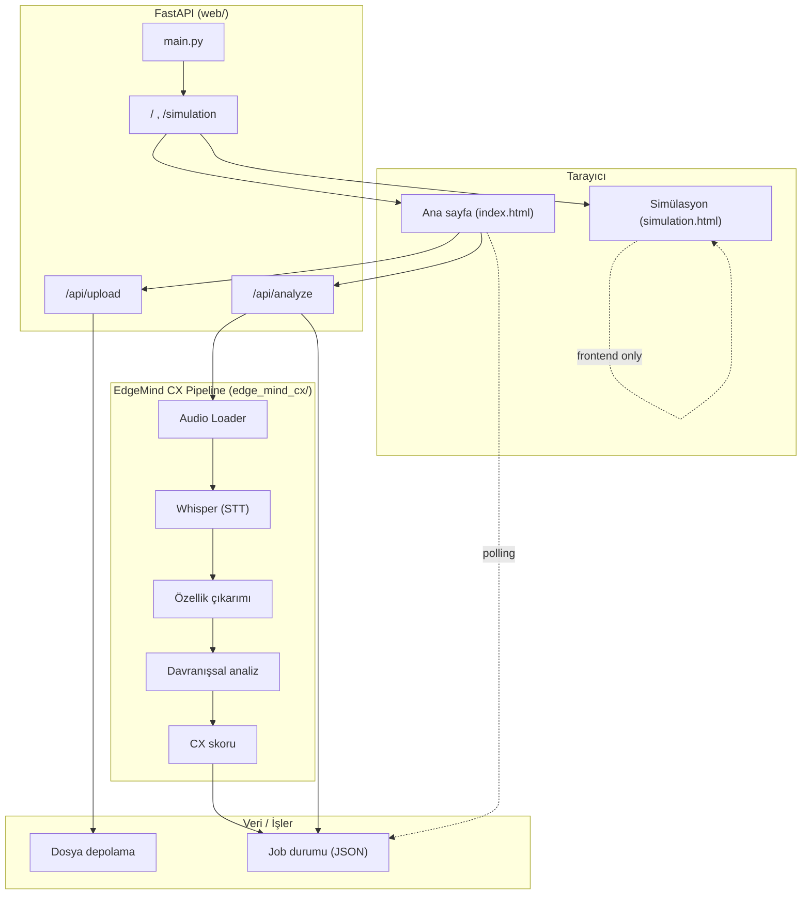

# EdgeMind CX – Teknik Mimari

## Sistem mimarisi (özet akış)

**Açıklama:** Tarayıcıdaki Web UI, ses yükleme ve analiz isteklerini FastAPI’ye gönderir. FastAPI, EdgeMind CX pipeline’ını (Whisper, özellik çıkarımı, davranışsal analiz, CX skoru) çalıştırır; sonuçlar API üzerinden UI’a döner. Edge Simulation sayfası, aynı UI içinde simüle edge/cloud metriklerini ve senaryoları gösterir.

---

## Detaylı bileşen diyagramı

---

## Bileşenler

| Bileşen | Konum | Görevi |
|--------|--------|--------|
| **Web UI** | `web/ui/` | Ses yükleme, analiz tetikleme, dashboard, simülasyon sayfası |
| **FastAPI** | `web/main.py`, `web/api/` | REST API, HTML servisi, upload/analyze endpoint’leri |
| **AI Pipeline** | `edge_mind_cx/` | Ses → Whisper → özellikler → davranışsal analiz → CX skoru |
| **Edge Simulation** | `web/ui/simulation/` | What-if senaryoları, edge/cloud dağılımı (sadece frontend) |

---

## Veri akışı (analiz isteği)

1. Kullanıcı `.wav` yükler → **FastAPI** `/api/upload` ile dosyayı kaydeder.
2. Kullanıcı analiz başlatır → **FastAPI** `/api/analyze/{call_id}` job oluşturur; arka planda **EdgeMind CX pipeline** çalışır.
3. Pipeline: ses → Whisper (transkript) → özellikler → stres/empati → CX skoru → sonuç **job JSON** olarak saklanır.
4. UI job id ile durum sorgular; tamamlanınca sonuçları (transkript, skorlar) gösterir.
5. **Simülasyon** sayfası sabit/simüle metriklerle edge vs cloud karşılaştırması yapar; backend’e istek atmaz.
